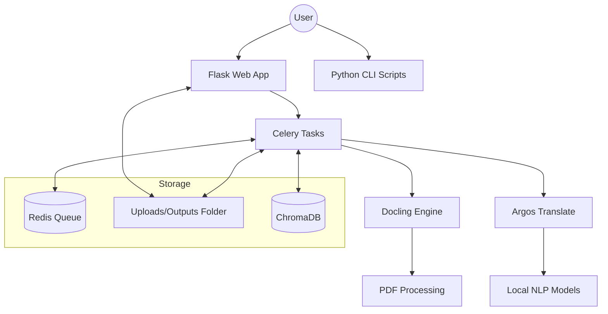
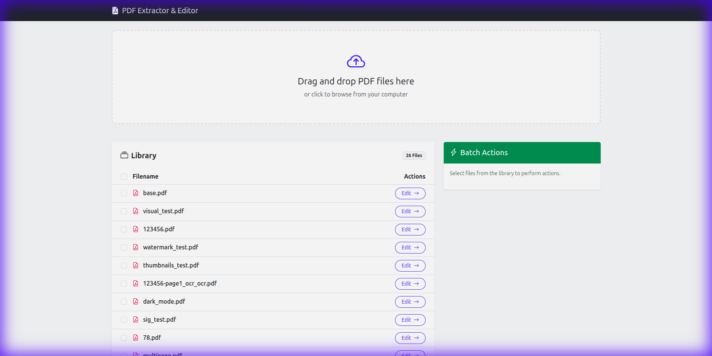
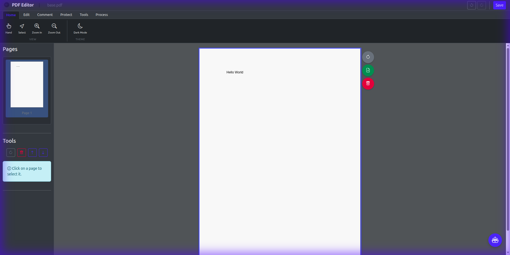

# PDF Content Extractor & Translator

  

A powerful, privacy-focused tool to extract structured content from PDF documents. It converts PDFs into editable formats like Microsoft Word (`.docx`), OpenDocument Text (`.odt`), and CSV (for tables), with built-in offline translation capabilities.

---

## 📑 Table of Contents
- [🚀 Key Features](#-key-features)
- [🏁 Quick Start](#-quick-start)
- [🛠️ Prerequisites & Installation](#️-prerequisites--installation)
- [🏗️ Architecture Overview](#️-architecture-overview)
- [🖥️ Usage: Web Application](#️-usage-web-application)
- [💻 Usage: CLI](#-usage-command-line-interface-cli)
- [🧪 Running Tests](#-running-tests)
- [🤝 Contributing](#-contributing)

---

## 🚀 Key Features

*   **Full Document Extraction:** Converts PDFs to `.docx` preserving structure (headings, paragraphs, lists) and styling assisted by [Docling](https://github.com/DS4SD/docling).
*   **Table Extraction:** Detects tables and exports them to CSV or Word documents.
*   **Offline Translation:** Local translation to Spanish, French, German, and more using `argostranslate`. **No API keys needed.**
*   **PDF Editor:** Annotate, redact, sign, and manipulate pages (merge/split/compress).
*   **Local AI Chat:** ask questions about your PDFs 100% offline via Ollama.
*   **Dual Mode:** Web UI (Flask) or Command-Line scripts.

---

## 🏁 Quick Start

### 🐳 Option A: Docker (Recommended)
The fastest way to get started with all dependencies (Redis, Tesseract, models) pre-configured.

```bash
git clone https://github.com/matis-dev/pdf-extractor-translator.git
cd pdf-extractor-translator
docker-compose up --build
```
*Access at: http://localhost:5000*

### 🐍 Option B: Manual Setup
Requires **Python 3.9+** and system dependencies.

```bash
# Install system deps (Ubuntu/Debian)
sudo apt update && sudo apt install redis-server tesseract-ocr libtesseract-dev pandoc

# Setup Python environment
python3 -m venv venv && source venv/bin/activate
pip install -r requirements.txt

# Start everything with one script
./scripts/start.sh
```

**Alternative (Manual)**
```bash
# Start services (in separate terminals)
redis-server
export PYTHONPATH=$(pwd)/src
celery -A src.app.celery worker --loglevel=info
python src/app.py
```

---

## 🏗️ Architecture Overview



---

## 📸 Screenshots

### Home Page - Library & Upload


### Editor Page - Annotation & Manipulation Tools


---

## 🛠️ Prerequisites & Installation

### 1. System Dependencies

You need to install a few system-level tools before running the python scripts.

*   **Redis:** Required for the background worker queue.
    *   *Docker:* `docker run -d -p 6379:6379 --name redis-pdf-extractor --restart always redis`
    *   *Linux (apt):* `sudo apt-get install redis-server`
*   **Pandoc:** Required for `.odt` conversion.
    *   *Linux (apt):* `sudo apt-get install pandoc`
    *   *Conda:* `conda install -c conda-forge pandoc`
*   **Tesseract OCR:** Required by Docling for OCR capabilities.
    *   *Linux (apt):* `sudo apt-get install tesseract-ocr`
    *   *macOS:* `brew install tesseract`
    *   *Windows:* [Installer](https://github.com/UB-Mannheim/tesseract/wiki)

### 2. Python Dependencies

Clone the repository and install the required Python packages.

```bash
# Recommended: Create a virtual environment
python3 -m venv venv
source venv/bin/activate

# Install dependencies
pip install "docling[tesserocr]" pandas python-docx Flask celery redis argostranslate pdfplumber
```

> **Note:** If you encounter errors related to `tesserocr`, ensure you have the Tesseract development headers installed (e.g., `sudo apt-get install libtesseract-dev` on Ubuntu).

---

## 🖥️ Usage: Web Application

The web interface is the easiest way to use the tool, offering a simple drag-and-drop UI.

1.  **Start Redis:** Ensure your Redis server is running.
2.  **Start the Background Worker:**
    ```bash
    ./start_worker.sh
    ```
3.  **Start the Web Server:**
    ```bash
    python app.py
    # or ./start_app.sh
    ```
4.  **Access the App:** Open your browser and navigate to **[http://127.0.0.1:5000](http://127.0.0.1:5000)**.

---


## 🐳 Usage: Docker (Recommended)

Run the entire stack with a single command. This is the **most reliable way** to run the application as it handles all dependencies (Redis, OCR tools, Translation models) automatically.

```bash
docker-compose up --build
```
The app will be available at **[http://127.0.0.1:5000](http://127.0.0.1:5000)**. 

> **Note:** The first build may take a few minutes as it downloads and installs offline translation models. Subsequent runs will be instant.

To stop the application:
```bash
docker-compose down
```

---

## 💻 Usage: Command-Line Interface (CLI)

You can run the extraction scripts directly if you don't need the web UI or translation features.

### Extract Full Document to Word
Converts the entire PDF into a Word document.
```bash
python extract_full_document_to_word.py input_document.pdf
```
*Output:* `input_document_full_content.docx`

### Extract Tables to CSV
Extracts all tables found in the PDF into separate CSV files.
```bash
python extract_tables_to_csv.py input_document.pdf
```
*Output:* A folder named `input_document_tables/` containing CSV files.

### Extract Tables to Word
Extracts only the tables into a Word document.
```bash
python extract_tables_to_word.py input_document.pdf
```
*Output:* `input_document_tables.docx`

---

## 📂 Project Structure

*   `app.py`: Main Flask application entry point.
*   `tasks.py`: Celery tasks for handling long-running extractions and translations.
*   `extract_*.py`: Core logic scripts for Docling-based extraction.
*   `templates/`: HTML templates for the web interface.
## 📂 Project Structure

*   `app.py`: Main Flask application entry point.
*   `tasks.py`: Celery tasks for handling long-running extractions and translations.
*   `ai_utils.py`: Local AI and RAG logic.
*   `mcp_server.py`: MCP Server for AI assistants (see [MCP_README.md](MCP_README.md)).
*   `docs/`:
    *   [API Reference](docs/API.md) - Detailed route documentation.
    *   [Development Guide](docs/DEVELOPMENT.md) - Deep dive for contributors.
    *   [Architecture Diagram](#️-architecture-overview)
*   `static/`: Frontend assets (JS modules, CSS).
*   `templates/`: HTML templates.

---

## 🧪 Running Tests

### Prerequisites
Install development dependencies:
```bash
pip install -r requirements-dev.txt
```

### Run All Tests
```bash
python -m pytest
```

### Run Specific Test File
```bash
python -m pytest tests/test_frontend.py -v
```

---

## 🤝 Contributing

Contributions are welcome! 

- **Getting Started:** See [DEVELOPMENT.md](docs/DEVELOPMENT.md) for technical setup.
- **Workflow:** Read [CONTRIBUTING.md](CONTRIBUTING.md) for pull request guidelines.
- **Standards:** We adhere to a [Code of Conduct](CODE_OF_CONDUCT.md).

---

## ⚠️ Troubleshooting

*   **Tesseract Error:** If you see errors about `TESSDATA_PREFIX`, make sure the environment variable is set to your tessdata directory (e.g., `/usr/share/tesseract-ocr/5/tessdata/`).
*   **Redis Connection:** If the worker fails to connect, check if Redis is running on `localhost:6379`.
