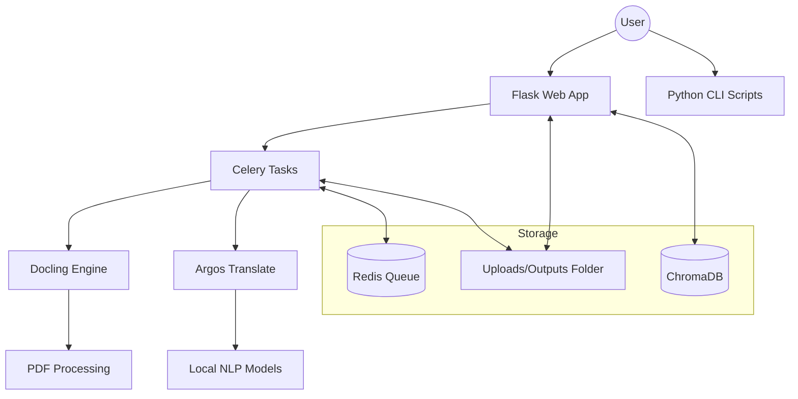

# PDF Content Extractor & Translator

  

**Turn static PDFs into living, editable data without your files ever leaving your machine.** 

This is a **feature-rich**, **privacy-focused** platform that converts Documents into structured formats (Word, CSV, ODT), translates them using local neural networks, and allows you to chat with your files using local LLMs.

---

## 📚 Documentation

*   **[Technical Manual](docs/TECHNICAL_MANUAL.md)** 👈 **Start Here for deep dives**
    *   System Architecture & Data Flow
    *   Detailed Usage Guide (GUI & CLI)
    *   API Reference
*   **[Development Guide](docs/DEVELOPMENT.md)** - For contributors.
*   **[MCP Server](docs/MCP_README.md)** - Connect this tool to AI assistants like Claude.

---

## 🚀 Key Features

*   **🛡️ Privacy First:** 100% offline processing. No external APIs, no cloud uploads.
*   **📄 Structural Extraction:** Converts PDFs to `.docx` while preserving massive layout details (tables, headings, lists) using [Docling](https://github.com/DS4SD/docling).
*   **🌍 Offline Translation:** Translate full documents to 9+ languages (English, Spanish, French, German, etc.) preserving layout.
*   **✏️ Rich PDF Editor:** Annotate, Redact, Sign, Merge, Split, and Compress PDFs in the browser.
*   **🤖 Local AI Chat:** Ask questions about your documents using completely local LLMs (via Ollama).
*   **🔌 MCP Support:** Expose these tools to your AI agent (Claude, etc.) via the Model Context Protocol.

---

## 🏁 Quick Start

### 🐳 Option A: Docker (Recommended)
The fastest way to run the full stack (App + Redis + OCR + Translation Models).

```bash
git clone https://github.com/matis-dev/pdf-extractor-translator.git
cd pdf-extractor-translator
docker-compose up --build
```
> **Access at:** [http://localhost:5000](http://localhost:5000)

### 🐍 Option B: Manual Setup
For developers who want to run it natively on Linux/macOS.

**Prerequisites:** `redis-server`, `tesseract-ocr`, `pandoc`.

```bash
# 1. Setup Environment
python3 -m venv venv && source venv/bin/activate
pip install -r requirements.txt

# 2. Start Services
./scripts/start.sh
```

---

## 🏗️ Architecture Overview



---

## 📸 Screenshots

### Home Page - Library & Upload


### Editor Page - Annotation & Manipulation Tools


---

## 📂 Project Structure

```text
src/
├── app.py                  # Main Flask Application
├── tasks.py                # Celery Background Workers
├── routes/                 # API Controllers
│   ├── ai_routes.py        # LLM & RAG Endpoints
│   ├── convert_routes.py   # Unified Conversion API
│   └── pdf_routes.py       # PDF Manipulation API
├── static/                 # Frontend (Vanilla JS Modules)
├── templates/              # Jinja2 HTML Templates
├── extract_*.py            # Standalone CLI Scripts
└── mcp_server.py           # Model Context Protocol Server
```

---

## 🤝 Contributing

We welcome contributions! Please see [CONTRIBUTING.md](CONTRIBUTING.md) for details on how to submit pull requests, report issues, and request features.

## 📄 License

This project is licensed under the MIT License - see the [LICENSE](LICENSE) file for details.
