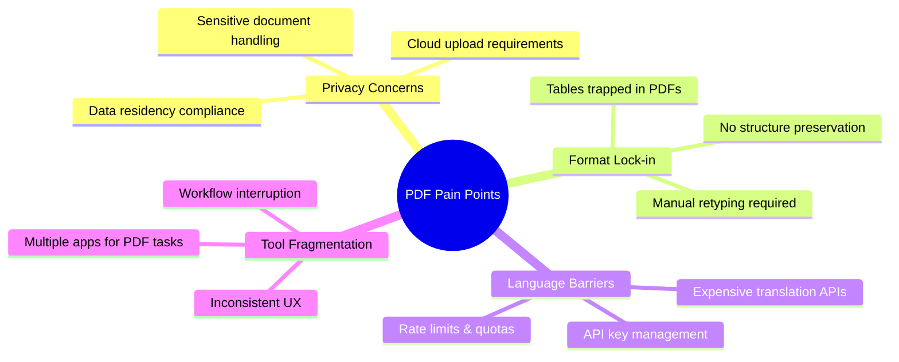
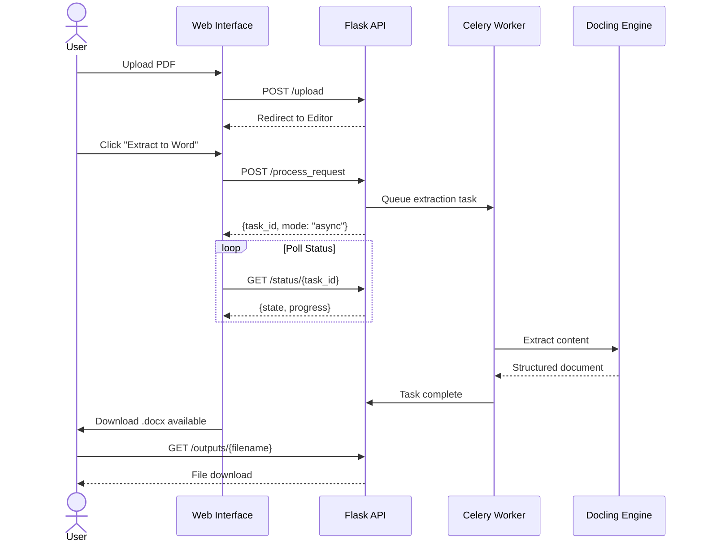
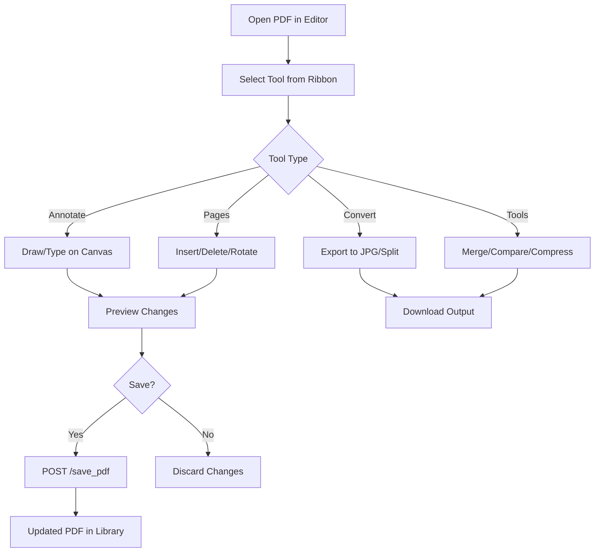
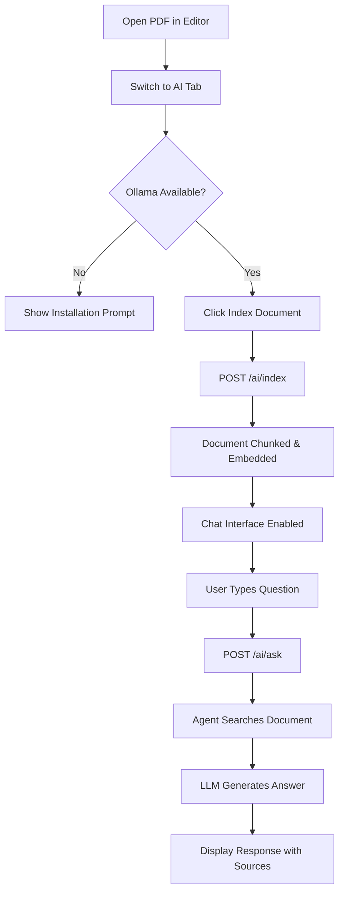
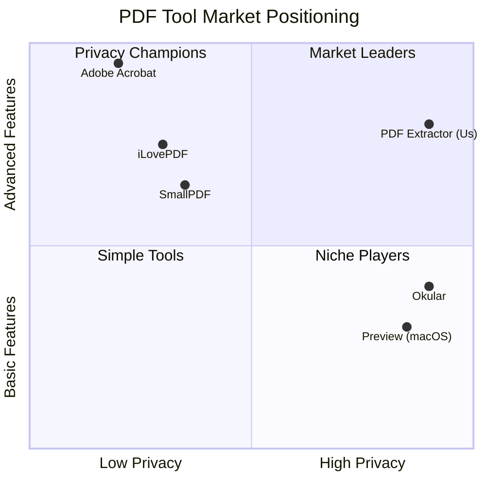

# Product Requirements Document (PRD)

## PDF Content Extractor & Translator

| Field              | Value                           |
| ------------------ | ------------------------------- |
| **Status**         | ✅ Released (v1.0)               |
| **Owner**          | Product Team                    |
| **Last Updated**   | 2025-12-20                      |
| **Target Release** | v1.0 (Current) / v1.1 (Planned) |

---

## Executive Summary

**PDF Content Extractor & Translator** is a privacy-first, fully offline PDF processing platform that enables users to extract structured content from PDFs, translate documents into 9+ languages, and perform comprehensive PDF editing—all without sending data to external servers. The product uniquely combines document intelligence (via Docling) with local AI capabilities (via Ollama) to deliver enterprise-grade functionality with complete data sovereignty.

---

## Phase 1: Context & Strategy (The "Why")

### 1.1 Problem Statement

#### Primary User Stories

| ID    | User Story                                                                                                                                                              | Priority |
| ----- | ----------------------------------------------------------------------------------------------------------------------------------------------------------------------- | -------- |
| US-01 | *As a **legal professional**, I want to extract tables from contracts into editable spreadsheets, so that I can analyze pricing terms without manual retyping.*         | P0       |
| US-02 | *As a **researcher**, I want to translate academic papers into my native language, so that I can consume international research without external translation services.* | P0       |
| US-03 | *As a **compliance officer**, I want to process sensitive documents locally, so that I maintain regulatory compliance (GDPR, HIPAA) without cloud exposure.*            | P0       |
| US-04 | *As an **office worker**, I want to merge, split, and compress PDFs, so that I can manage document workflows without switching between tools.*                          | P1       |
| US-05 | *As a **knowledge worker**, I want to ask questions about my PDFs in natural language, so that I can quickly find information in lengthy documents.*                    | P1       |

#### Pain Points Addressed



### 1.2 Strategic Alignment

#### Product Vision

> **"Own your documents. No cloud. No compromise."**

The PDF Content Extractor & Translator positions itself as the **privacy-first alternative** to cloud-based PDF platforms (iLovePDF, Adobe Acrobat, SmallPDF) by offering:

1. **Complete data sovereignty** — All processing happens locally
2. **AI-powered intelligence** — Local LLMs for document Q&A
3. **Professional-grade features** — Parity with commercial tools
4. **Zero subscription dependency** — Self-hosted, open-source core

#### North Star Metrics

| Metric                         | Definition                               | Target                     |
| ------------------------------ | ---------------------------------------- | -------------------------- |
| **Weekly Active Users (WAU)**  | Unique users accessing the app per week  | 1,000+ (community edition) |
| **Documents Processed / User** | Average PDFs processed per active user   | 10+ per week               |
| **Feature Coverage Score**     | % of iLovePDF features implemented       | 85%+                       |
| **Privacy-Sensitive Adoption** | Users citing "privacy" as primary driver | 60%+                       |

#### Strategic Differentiators

| Competitor Feature            | Our Advantage                          |
| ----------------------------- | -------------------------------------- |
| Cloud processing required     | 100% offline processing                |
| Translation via external APIs | Built-in Argos Translate (9 languages) |
| Subscription pricing          | Self-hosted, no recurring fees         |
| Generic PDF editing           | AI-powered document Q&A                |
| Vendor lock-in                | Open-source, Docker-deployable         |

### 1.3 Target Audience

#### Primary Personas

| Persona                            | Description                                                     | Key Needs                                         |
| ---------------------------------- | --------------------------------------------------------------- | ------------------------------------------------- |
| **Privacy-Conscious Professional** | Legal, medical, financial professionals handling sensitive data | Local processing, audit trails, compliance        |
| **International Researcher**       | Academics working with multi-language sources                   | Translation, extraction, citation-friendly output |
| **Self-Hosted Enthusiast**         | Tech-savvy users who prefer local tools                         | Docker deployment, customization, no telemetry    |

#### Secondary Personas

| Persona                  | Description                            | Key Needs                                         |
| ------------------------ | -------------------------------------- | ------------------------------------------------- |
| **Small Business Owner** | Non-technical users needing PDF tools  | Simple UI, no setup complexity, reliability       |
| **Enterprise IT Admin**  | Deploying tools for organizational use | Scalability, SSO integration (future), audit logs |

---

## Phase 2: Functional Requirements (The "What")

### 2.1 Core User Flows

#### Flow 1: Document Extraction (Happy Path)



#### Flow 2: PDF Editing (Happy Path)



#### Flow 3: AI Document Chat (Happy Path)



### 2.2 Feature List (Prioritized)

#### P0: Must-Have (MVP Complete ✅)

| Feature                      | Description                                    | Status    |
| ---------------------------- | ---------------------------------------------- | --------- |
| **PDF Upload**               | Drag-and-drop or file picker upload            | ✅ Shipped |
| **Full Document Extraction** | PDF → Word (.docx) with structure preservation | ✅ Shipped |
| **Table Extraction**         | PDF → CSV for all detected tables              | ✅ Shipped |
| **Offline Translation**      | Translate extracted content (9 languages)      | ✅ Shipped |
| **Basic Annotations**        | Text, highlight, redact, signature             | ✅ Shipped |
| **Page Operations**          | Insert, delete, rotate, reorder pages          | ✅ Shipped |
| **Merge PDFs**               | Combine multiple PDFs into one                 | ✅ Shipped |
| **Split PDF**                | Extract page ranges into separate files        | ✅ Shipped |
| **Compress PDF**             | Reduce file size via Ghostscript               | ✅ Shipped |
| **Local AI Chat**            | Q&A about indexed PDFs via Ollama              | ✅ Shipped |

#### P1: Should-Have (v1.1 Roadmap)

| Feature                | Description                          | Status    | Target |
| ---------------------- | ------------------------------------ | --------- | ------ |
| **PDF/A Compliance**   | Convert to archival format           | 📋 Planned | v1.1   |
| **Batch Translation**  | Translate multiple documents at once | 📋 Planned | v1.1   |
| **Custom Fonts**       | User-uploaded fonts for annotations  | 📋 Planned | v1.1   |
| **Form Filling**       | Fill interactive PDF forms           | 📋 Planned | v1.2   |
| **OCR Enhancement**    | Improve text layer for scanned PDFs  | 📋 Planned | v1.1   |
| **Keyboard Shortcuts** | Full keyboard navigation             | ✅ Shipped | v1.0   |

#### P2: Could-Have (Future Consideration)

| Feature                   | Description                    | Notes                            |
| ------------------------- | ------------------------------ | -------------------------------- |
| **Word/Excel → PDF**      | Reverse conversion flow        | Requires LibreOffice integration |
| **PWA Mobile App**        | Progressive Web App for mobile | Significant effort               |
| **Plugin Architecture**   | Extensibility for custom tools | Enterprise feature               |
| **Collaborative Editing** | Real-time multi-user editing   | Requires significant infra       |
| **Cloud Sync (Opt-in)**   | Optional cloud backup          | Contradicts privacy positioning  |

#### Won't-Have (Explicit Scope Exclusions)

| Feature                        | Reason for Exclusion                 |
| ------------------------------ | ------------------------------------ |
| **Mandatory Cloud Processing** | Violates core privacy principle      |
| **Subscription Licensing**     | Contradicts open-source positioning  |
| **Native Mobile Apps**         | Out of scope for current resources   |
| **Video/Audio Embedding**      | Not aligned with document focus      |
| **Real-time Collaboration**    | Requires infrastructure beyond scope |

### 2.3 Non-Functional Requirements (NFRs)

#### Performance

| Requirement           | Specification                                         | Measurement       |
| --------------------- | ----------------------------------------------------- | ----------------- |
| **Page Render Time**  | The system shall render PDF pages in < 500ms          | P95 latency       |
| **Extraction Speed**  | The system shall extract a 50-page PDF in < 30s       | Wall clock time   |
| **UI Responsiveness** | The system shall respond to user input in < 100ms     | Input-to-feedback |
| **Memory Footprint**  | The system shall process 200-page PDFs with < 4GB RAM | Peak memory       |

#### Security

| Requirement                   | Specification                                                             |
| ----------------------------- | ------------------------------------------------------------------------- |
| **Data Isolation**            | The system shall process all files locally without external network calls |
| **Path Traversal Prevention** | The system shall validate all file paths against allowed directories      |
| **Input Sanitization**        | The system shall sanitize all user inputs using `secure_filename()`       |
| **No Telemetry**              | The system shall not collect or transmit usage analytics                  |

#### Scalability

| Requirement          | Specification                                                      |
| -------------------- | ------------------------------------------------------------------ |
| **Concurrent Users** | The system shall support 10 concurrent users per Celery worker     |
| **Task Queue Depth** | The system shall queue up to 100 pending tasks without degradation |
| **File Size Limit**  | The system shall process PDFs up to 100MB                          |

#### Reliability

| Requirement              | Specification                                                       |
| ------------------------ | ------------------------------------------------------------------- |
| **Task Recovery**        | The system shall recover queued tasks after worker restart          |
| **Graceful Degradation** | The system shall function without Redis (synchronous mode)          |
| **Error Logging**        | The system shall log all errors with stack traces to rotating files |

---

## Phase 3: User Experience (The "How")

### 3.1 UI/UX Guidelines

#### Screen States

| State                    | Visual Treatment                              | User Action               |
| ------------------------ | --------------------------------------------- | ------------------------- |
| **Empty (Library)**      | Illustration with "Upload your first PDF" CTA | Drag-drop or click upload |
| **Loading (Processing)** | Progress bar with status text, cancel button  | Wait or cancel            |
| **Error**                | Red toast notification with retry action      | Retry or dismiss          |
| **Success**              | Green toast with download link                | Download or continue      |

#### Key UI Components

```
┌─────────────────────────────────────────────────────────────────┐
│  [Logo]  PDF Extractor           🌙 Dark Mode    👤 Settings    │
├─────────────────────────────────────────────────────────────────┤
│  Home  │  View  │ Annotate │ Pages │ Convert │ Tools │ AI      │
├─────────────────────────────────────────────────────────────────┤
│                                                                 │
│  ┌──────────┐  ┌───────────────────────────────────────────┐   │
│  │ Thumb 1  │  │                                           │   │
│  ├──────────┤  │                                           │   │
│  │ Thumb 2  │  │              PDF Canvas                   │   │
│  ├──────────┤  │              (Main View)                  │   │
│  │ Thumb 3  │  │                                           │   │
│  ├──────────┤  │                                           │   │
│  │ Thumb 4  │  │                                           │   │
│  └──────────┘  └───────────────────────────────────────────┘   │
│                                                                 │
├─────────────────────────────────────────────────────────────────┤
│  Page 1 of 12     │     Zoom: 100%     │     🐛 Report Bug     │
└─────────────────────────────────────────────────────────────────┘
```

#### Design System References

| Component               | Implementation                               |
| ----------------------- | -------------------------------------------- |
| **Buttons**             | Bootstrap 5 `.btn-primary`, `.btn-outline-*` |
| **Modals**              | Bootstrap 5 modal with custom backdrop       |
| **Toast Notifications** | Bootstrap 5 toast, top-right position        |
| **Icons**               | Bootstrap Icons (`bi-*` classes)             |
| **Colors**              | CSS custom properties in `index.css`         |

### 3.2 Copy & Tone Guidelines

#### Voice Principles

| Principle                 | Example                                                  |
| ------------------------- | -------------------------------------------------------- |
| **Friendly, not casual**  | "Your document is ready!" not "Yo, doc's done!"          |
| **Technical when needed** | "Processing failed: Invalid PDF structure"               |
| **Action-oriented**       | "Click Extract to begin" not "Extraction can be started" |
| **Reassuring on errors**  | "Something went wrong. Your file is safe."               |

#### Error Messages

| Scenario               | Message                                                                             |
| ---------------------- | ----------------------------------------------------------------------------------- |
| **Upload failed**      | "We couldn't upload that file. Please check it's a valid PDF and try again."        |
| **Extraction failed**  | "Extraction encountered an error. This PDF may be corrupted or password-protected." |
| **AI unavailable**     | "Local AI is not available. Install Ollama to enable document chat."                |
| **Large file warning** | "This PDF is quite large. Processing may take a few moments."                       |

---

## Phase 4: Implementation & Analytics

### 4.1 Data Requirements

#### Existing Data Stores

| Store                        | Purpose                  | Schema                  |
| ---------------------------- | ------------------------ | ----------------------- |
| **File System (`uploads/`)** | Raw uploaded PDFs        | Flat file storage       |
| **File System (`outputs/`)** | Processed documents      | Flat file storage       |
| **Redis**                    | Task queue, result cache | Celery-managed          |
| **ChromaDB**                 | AI embeddings            | Collection per document |

#### New Data Fields (v1.1)

| Entity                | Field                   | Type      | Purpose                     |
| --------------------- | ----------------------- | --------- | --------------------------- |
| **Document Metadata** | `processed_at`          | Timestamp | Track processing history    |
| **Document Metadata** | `language_detected`     | String    | Auto-detect source language |
| **User Preferences**  | `default_export_format` | Enum      | Remember user choices       |
| **AI Session**        | `conversation_history`  | JSON      | Multi-turn chat context     |

### 4.2 Analytics Events

> **Note:** The system does not collect telemetry by default. These events are for **optional self-hosted analytics** only.

| Event Name             | Trigger                    | Properties                       |
| ---------------------- | -------------------------- | -------------------------------- |
| `document_uploaded`    | PDF upload complete        | `file_size`, `page_count`        |
| `extraction_started`   | Process request initiated  | `extraction_type`, `target_lang` |
| `extraction_completed` | Task finished successfully | `duration_ms`, `output_type`     |
| `extraction_failed`    | Task failed                | `error_type`, `duration_ms`      |
| `ai_question_asked`    | User submits chat question | `question_length`, `model`       |
| `tool_selected`        | User clicks toolbar button | `tool_name`, `tab_name`          |

### 4.3 Risks & Dependencies

#### Technical Dependencies

| Dependency          | Risk Level | Mitigation                             |
| ------------------- | ---------- | -------------------------------------- |
| **Docling**         | Medium     | Pin version, monitor releases          |
| **Argos Translate** | Low        | Bundled models, offline resilient      |
| **Ollama**          | Medium     | Optional feature, graceful degradation |
| **Redis**           | Low        | Fallback to synchronous mode           |
| **Ghostscript**     | Low        | Standard system package                |

#### Compliance Considerations

| Regulation | Relevance           | Compliance Status                              |
| ---------- | ------------------- | ---------------------------------------------- |
| **GDPR**   | High (EU users)     | ✅ Compliant (no data leaves user's machine)    |
| **HIPAA**  | Medium (healthcare) | ✅ Compliant (self-hosted, no PHI transmission) |
| **SOC 2**  | Low (enterprise)    | ⚠️ N/A (not cloud-hosted)                       |
| **CCPA**   | Low (California)    | ✅ Compliant (no personal data collection)      |

#### Business Risks

| Risk                        | Probability | Impact | Mitigation                                 |
| --------------------------- | ----------- | ------ | ------------------------------------------ |
| Docling API changes         | Medium      | High   | Version pinning, abstraction layer         |
| Ollama deprecation          | Low         | Medium | LangChain supports multiple providers      |
| Community adoption stalls   | Medium      | Medium | Marketing through privacy-focused channels |
| Enterprise feature requests | High        | Low    | Modular architecture for add-ons           |

---

## Acceptance Criteria (Gherkin)

### Feature: Document Extraction

```gherkin
Scenario: Extract PDF to Word document
  Given I have uploaded a PDF file named "contract.pdf"
  And the PDF has 10 pages with text and tables
  When I click "Full Content → Word" in the Home tab
  And I click "Process" without selecting a translation language
  Then I should see a progress indicator
  And the task should complete within 60 seconds
  And I should be offered a download for "contract_full_content.docx"
  And the Word document should contain all text from the PDF
  And the Word document should contain all tables from the PDF

Scenario: Extract PDF with translation
  Given I have uploaded a PDF file named "report.pdf"
  And the PDF contains English text
  When I select "Spanish" as the target language
  And I click "Process"
  Then the resulting Word document should contain Spanish text
  And the original document structure should be preserved
```

### Feature: PDF Editing

```gherkin
Scenario: Add text annotation to PDF
  Given I have a PDF open in the editor
  When I select the "Text" tool from the Annotate tab
  And I click on page 1 at coordinates (100, 200)
  And I type "Reviewed by: John Doe"
  And I click "Save"
  Then the PDF should contain the text annotation
  And reopening the PDF should show the annotation

Scenario: Merge multiple PDFs
  Given I have 3 PDFs in my library: "doc1.pdf", "doc2.pdf", "doc3.pdf"
  When I select all 3 documents
  And I click "Merge" from the batch actions
  Then a new PDF should be created
  And it should contain all pages from the 3 source PDFs in order
```

### Feature: AI Document Chat

```gherkin
Scenario: Ask question about indexed document
  Given I have a PDF open in the editor
  And Ollama is running with "llama3.2:3b" model
  And I have clicked "Index Document" in the AI tab
  When I type "What is the main topic of this document?"
  And I press Enter
  Then I should see a response within 10 seconds
  And the response should reference content from the PDF
  And source citations should be displayed

Scenario: AI unavailable gracefully degrades
  Given Ollama is not running
  When I navigate to the AI tab
  Then I should see a message "Local AI is not available"
  And I should see instructions to install Ollama
  And the rest of the editor should remain functional
```

### Feature: Offline Operation

```gherkin
Scenario: Process document without internet
  Given my machine has no internet connectivity
  And Redis is running locally
  And Celery worker is running
  When I upload and process a PDF
  Then the extraction should complete successfully
  And no network requests should be made
```

---

## Appendix A: Technical Stack Summary

| Layer                | Technology                      | Purpose                   |
| -------------------- | ------------------------------- | ------------------------- |
| **Frontend**         | Vanilla JS, Bootstrap 5, pdf.js | UI rendering, PDF display |
| **Backend**          | Flask, Python 3.9+              | API server, routing       |
| **Task Queue**       | Celery, Redis                   | Background processing     |
| **PDF Processing**   | Docling, pypdf, pdfplumber      | Extraction, manipulation  |
| **Translation**      | Argos Translate                 | Offline translation       |
| **AI/RAG**           | LangChain, ChromaDB, Ollama     | Document Q&A              |
| **Containerization** | Docker, docker-compose          | Deployment                |

---

## Appendix B: Competitive Positioning



---

## Appendix C: Revision History

| Version | Date       | Author       | Changes              |
| ------- | ---------- | ------------ | -------------------- |
| 1.0     | 2025-12-20 | Product Team | Initial PRD creation |

---

*This PRD is a living document and will be updated as the product evolves.*
