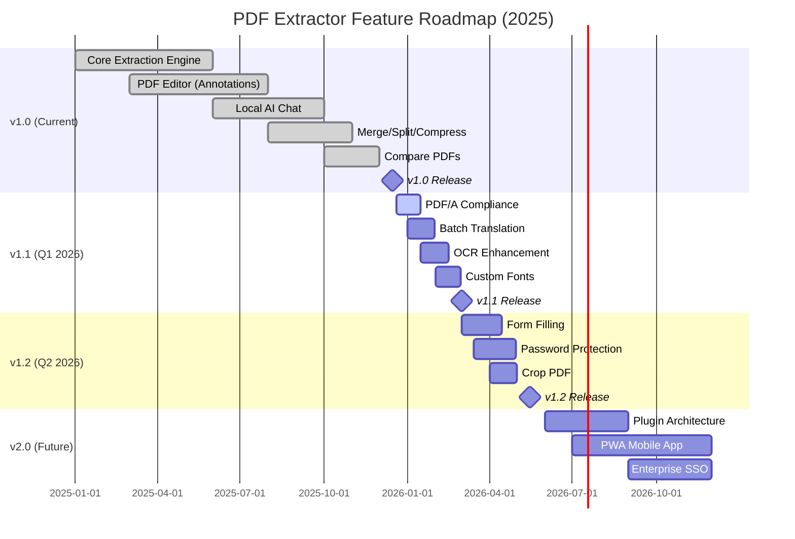
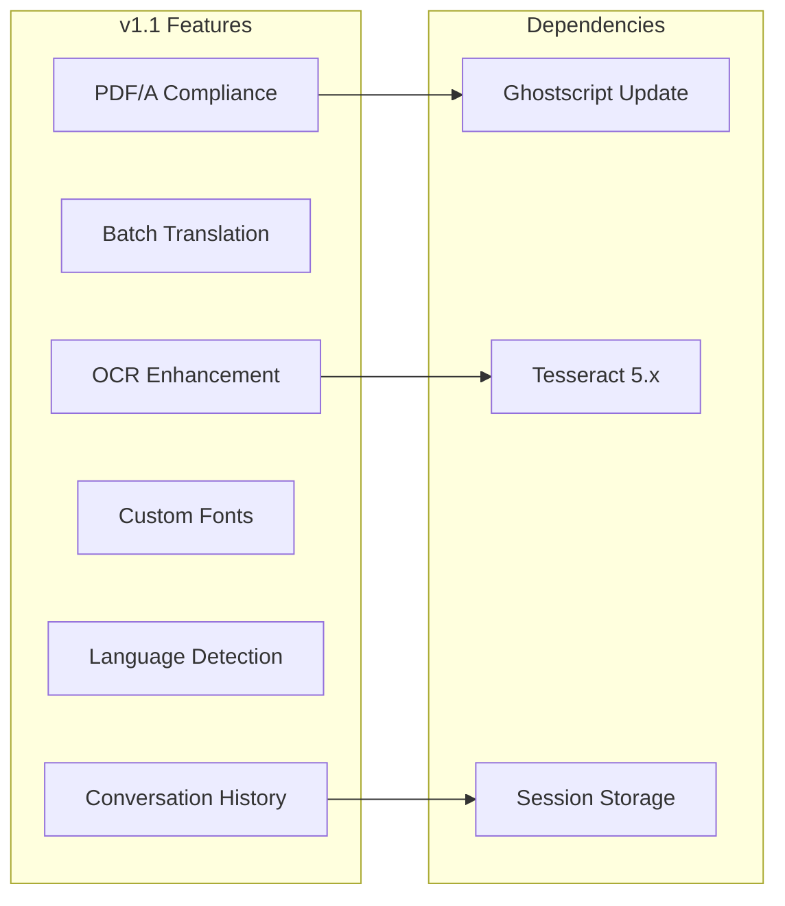
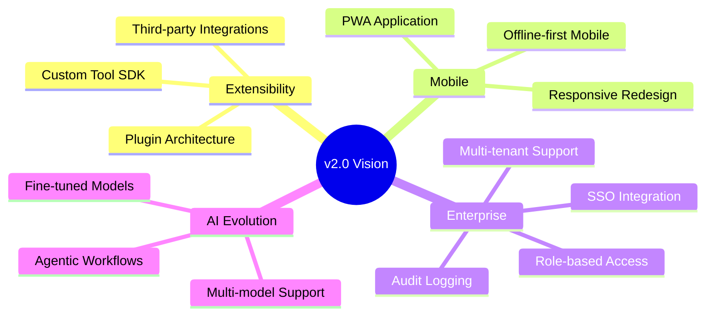
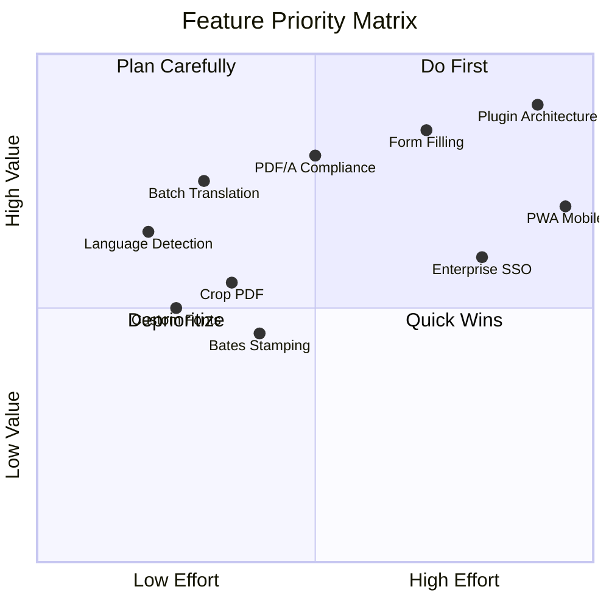

# Product Roadmap

> **PDF Content Extractor & Translator** — Feature Development Timeline

---

## Roadmap Overview

---

## Current Release: v1.0 ✅

**Status:** Released | **Date:** December 2025

### Shipped Features

| Category        | Feature              | Description                              |
| --------------- | -------------------- | ---------------------------------------- |
| **Extraction**  | Full Document → Word | PDF to .docx with structure preservation |
| **Extraction**  | Table → CSV          | Detect and export tables                 |
| **Extraction**  | Table → Word         | Tables in document format                |
| **Translation** | Offline Translation  | 9 languages via Argos Translate          |
| **Editor**      | Text Annotations     | Add text anywhere on PDF                 |
| **Editor**      | Highlight/Redact     | Markup and redaction tools               |
| **Editor**      | Shapes               | Rectangle, ellipse, line, arrow          |
| **Editor**      | Digital Signature    | Draw, type, or upload signatures         |
| **Editor**      | Sticky Notes         | Comment annotations                      |
| **Pages**       | Insert/Delete/Rotate | Full page manipulation                   |
| **Pages**       | Reorder              | Drag-and-drop page ordering              |
| **Tools**       | Merge PDFs           | Combine multiple documents               |
| **Tools**       | Split PDF            | Extract page ranges                      |
| **Tools**       | Compress             | Reduce file size                         |
| **Tools**       | Compare PDFs         | Visual diff between documents            |
| **Tools**       | Repair PDF           | Fix corrupted files                      |
| **Convert**     | PDF to JPG           | Export pages as images                   |
| **Protect**     | Watermark            | Add text watermarks                      |
| **AI**          | Local Chat           | Q&A via Ollama                           |
| **AI**          | Document Indexing    | RAG-based retrieval                      |

---

## Next Release: v1.1 📋

**Status:** In Development | **Target:** Q1 2026

### Planned Features

| Feature                  | Priority | Description                                          | Effort |
| ------------------------ | -------- | ---------------------------------------------------- | ------ |
| **PDF/A Compliance**     | P1       | Convert PDFs to archival format (PDF/A-1b, PDF/A-2b) | 4 pts  |
| **Batch Translation**    | P1       | Translate multiple documents in one operation        | 3 pts  |
| **OCR Enhancement**      | P1       | Improve text layer quality for scanned PDFs          | 3 pts  |
| **Custom Fonts**         | P1       | Upload custom fonts for annotations                  | 2 pts  |
| **Language Detection**   | P1       | Auto-detect source language for translation          | 2 pts  |
| **Conversation History** | P1       | Persist AI chat across sessions                      | 2 pts  |

### v1.1 Success Criteria

| Metric                        | Target         |
| ----------------------------- | -------------- |
| PDF/A validation pass rate    | 95%+           |
| Batch processing throughput   | 10 docs/minute |
| OCR accuracy improvement      | +15% vs v1.0   |
| User font upload success rate | 99%+           |

---

## Future Release: v1.2 📋

**Status:** Planned | **Target:** Q2 2026

### Planned Features

| Feature                 | Priority | Description                            | Effort |
| ----------------------- | -------- | -------------------------------------- | ------ |
| **Form Filling**        | P1       | Fill interactive PDF forms (AcroForms) | 5 pts  |
| **Password Protection** | P1       | Add/remove PDF passwords               | 3 pts  |
| **Crop PDF**            | P1       | Remove margins and unwanted areas      | 3 pts  |
| **Page Numbers**        | P2       | Add automatic page numbering           | 2 pts  |
| **Bates Stamping**      | P2       | Legal document numbering               | 3 pts  |

---

## Long-Term Vision: v2.0 🔮

**Status:** Exploration | **Target:** 2026-2027

### Strategic Initiatives

| Initiative              | Description                    | Business Value                   |
| ----------------------- | ------------------------------ | -------------------------------- |
| **Plugin Architecture** | Allow third-party extensions   | Ecosystem growth, customization  |
| **PWA Mobile App**      | Progressive Web App for mobile | Broader reach, mobile users      |
| **Enterprise SSO**      | SAML/OIDC integration          | Enterprise sales enablement      |
| **Multi-model AI**      | Support multiple LLM providers | Flexibility, vendor independence |

---

## Feature Prioritization Matrix

---

## Competitive Gap Closure

### Current Status vs iLovePDF

| Feature                 | iLovePDF | Us (v1.0) | Us (v1.2) | Gap Status        |
| ----------------------- | -------- | --------- | --------- | ----------------- |
| Merge PDF               | ✅        | ✅         | ✅         | Closed            |
| Split PDF               | ✅        | ✅         | ✅         | Closed            |
| Compress                | ✅        | ✅         | ✅         | Closed            |
| Shapes                  | ✅        | ✅         | ✅         | Closed            |
| Digital Signature       | ✅        | ✅         | ✅         | Closed            |
| Watermark               | ✅        | ✅         | ✅         | Closed            |
| Compare PDFs            | ✅        | ✅         | ✅         | Closed            |
| PDF/A                   | ✅        | ❌         | ✅         | **v1.1**          |
| Crop PDF                | ✅        | ❌         | ✅         | **v1.2**          |
| Form Filling            | ✅        | ❌         | ✅         | **v1.2**          |
| Password Protection     | ✅        | ❌         | ✅         | **v1.2**          |
| **Offline Translation** | ❌        | ✅         | ✅         | **Our Advantage** |
| **Local AI Chat**       | ❌        | ✅         | ✅         | **Our Advantage** |
| **Self-Hosted**         | ❌        | ✅         | ✅         | **Our Advantage** |

---

## Release Cadence

| Release           | Cycle     | Focus                               |
| ----------------- | --------- | ----------------------------------- |
| **Patch (x.x.1)** | As needed | Bug fixes, security patches         |
| **Minor (x.1.0)** | Quarterly | New features, improvements          |
| **Major (2.0.0)** | Annually  | Breaking changes, major initiatives |

---

## How to Contribute

Want to help build these features? 

1. Check the [GitHub Issues](https://github.com/matis-dev/pdf-extractor-translator/issues) for open tasks
2. Read [CONTRIBUTING.md](../CONTRIBUTING.md) for guidelines
3. Discuss new ideas in [GitHub Discussions](https://github.com/matis-dev/pdf-extractor-translator/discussions)

---

*Roadmap last updated: 2025-12-20*
