# PDF Content Extractor & Translator

> A privacy-first, fully offline solution for extracting, editing, and translating PDF documents.

---

## Table of Contents

- [Overview](#overview)
- [Architecture](#architecture)
- [Prerequisites & Setup](#prerequisites--setup)
- [Usage Guide](#usage-guide)
  - [Web Application](#web-application)
  - [Command-Line Interface](#command-line-interface)
  - [MCP Server for AI Assistants](#mcp-server-for-ai-assistants)
- [API Reference](#api-reference)
- [Frontend Architecture](#frontend-architecture)
- [AI Integration](#ai-integration)
- [Development Guide](#development-guide)
- [Troubleshooting](#troubleshooting)
- [Security Considerations](#security-considerations)
- [Performance Tuning](#performance-tuning)

---

## Overview

### What Problem Does This Solve?

Traditional PDF-to-Word converters often:
- Require cloud uploads, compromising data privacy
- Lose document structure (headings, tables, images)
- Lack translation capabilities or require API keys

**PDF Content Extractor & Translator** addresses all of these with:

| Feature                      | Description                                                     |
| ---------------------------- | --------------------------------------------------------------- |
| **Full Document Extraction** | Converts PDFs to `.docx` while preserving structure and styling |
| **Table Extraction**         | Exports tables to CSV or Word documents                         |
| **Offline Translation**      | Translates to 9+ languages using local AI models                |
| **PDF Editor**               | Annotate, redact, sign, merge, split, and compress PDFs         |
| **Local AI Chat**            | Ask questions about PDFs via Ollama (100% offline)              |
| **MCP Server**               | Expose PDF tools to AI assistants like Claude                   |

### Key Technologies

- **Backend:** Python 3.9+, Flask, Celery, Redis
- **PDF Processing:** Docling, pdf-lib, pypdf, pdfplumber
- **Translation:** Argos Translate (offline, no API keys)
- **AI/RAG (Retrieval-Augmented Generation):** LangChain, ChromaDB, Ollama
- **Frontend:** Vanilla JavaScript (ES6+), Bootstrap 5

---

## Architecture

### System Context Diagram

```mermaid
flowchart TD
    subgraph Users
        A[("👤 End User")]
        B[("🤖 AI Assistant")]
    end

    subgraph "PDF Extractor Application"
        C[Flask Web Server<br/><i>app.py</i>]
        D[Celery Worker<br/><i>tasks.py</i>]
        E[MCP Server<br/><i>mcp_server.py</i>]
    end

    subgraph "Processing Engines"
        F[Docling Engine<br/><i>Document Extraction</i>]
        G[Argos Translate<br/><i>Offline Translation</i>]
        H[pdf-lib / pypdf<br/><i>PDF Manipulation</i>]
    end

    subgraph "Storage Layer"
        I[(Redis Queue)]
        J[(ChromaDB<br/>Vector Store)]
        K[📁 File System<br/>uploads/ outputs/]
    end

    subgraph "AI Layer"
        L[Ollama<br/><i>Local LLM</i>]
    end

    A -->|HTTP Requests| C
    A -->|CLI| F
    B -->|MCP Protocol| E
    
    C -->|Queue Tasks| D
    D <-->|Jobs| I
    D --> F
    D --> G
    D --> H
    
    C <-->|Store/Retrieve| K
    D <-->|Store/Retrieve| K
    
    C -->|RAG Queries| J
    C -->|LLM Requests| L
    J <-->|Embeddings| L
```



### Data Flow: Document Extraction


### Component Responsibilities

| Component    | File                   | Responsibility                              |
| ------------ | ---------------------- | ------------------------------------------- |
| Web Server   | `app.py`               | HTTP routes, file uploads, real-time status |
| Task Queue   | `tasks.py`             | Background extraction, translation          |
| AI Utilities | `ai_utils.py`          | PDF indexing, RAG Q&A, agent workflow       |
| MCP Server   | `mcp_server.py`        | Tool exposure for AI assistants             |
| Translation  | `translation_utils.py` | Argos Translate wrapper                     |
| Logging      | `logging_config.py`    | Structured logging with rotation            |

---

## Prerequisites & Setup

### System Requirements

| Dependency              | Purpose                    | Installation                                      |
| ----------------------- | -------------------------- | ------------------------------------------------- |
| **Python 3.9+**         | Runtime                    | [python.org](https://www.python.org/downloads/)   |
| **Redis**               | Background task queue      | `sudo apt install redis-server`                   |
| **Tesseract OCR**       | Image-based PDF extraction | `sudo apt install tesseract-ocr libtesseract-dev` |
| **Pandoc**              | ODT conversion             | `sudo apt install pandoc`                         |
| **Ghostscript**         | PDF compression            | `sudo apt install ghostscript`                    |
| **Poppler**             | PDF-to-image conversion    | `sudo apt install poppler-utils`                  |
| **Ollama** *(optional)* | Local AI chat              | [ollama.com](https://ollama.com)                  |

### Quick Start with Docker (Recommended)

Docker bundles all dependencies, ensuring consistent behavior across environments.

```bash
# Clone the repository
git clone https://github.com/matis-dev/pdf-extractor-translator.git
cd pdf-extractor-translator

# Build and start all services
docker-compose up --build
```

Access the application at **http://localhost:5000**.

> **Note:** The first build downloads translation models (~500MB). Subsequent starts are instant.

### Manual Installation

1. **Create a virtual environment:**
   ```bash
   python3 -m venv venv
   source venv/bin/activate
   ```

2. **Install Python dependencies:**
   ```bash
   pip install -r requirements.txt
   pip install -r requirements-dev.txt  # For testing
   ```

3. **Start services (in separate terminals):**
   ```bash
   # Terminal 1: Redis
   redis-server

   # Terminal 2: Celery worker
   celery -A tasks worker --loglevel=info

   # Terminal 3: Flask app
   python app.py
   ```

---

## Usage Guide

### Web Application

The web interface provides a complete PDF workflow through a modern, responsive UI.

#### Step 1: Upload PDFs

1. Navigate to **http://localhost:5000**.
2. Drag-and-drop PDF files onto the upload area, or click to browse.
3. Files appear in your library immediately.

#### Step 2: Edit PDFs

Open a PDF in the editor to access the ribbon toolbar:

| Tab          | Tools                                             |
| ------------ | ------------------------------------------------- |
| **Home**     | Undo, Redo, Full Content Download, Table Download |
| **View**     | Zoom, Thumbnail Panel, Page Navigation            |
| **Annotate** | Text, Highlight, Redact, Signature, Notes         |
| **Pages**    | Insert, Delete, Rotate, Reorder                   |
| **Convert**  | Export to JPG, Split, Compress                    |
| **Tools**    | Merge, Compare, Repair                            |
| **Protect**  | Watermark                                         |
| **AI**       | Chat, Model Selection                             |

#### Step 3: Extract Content

To convert a PDF to Word:

1. Click "**Full Content → Word**" in the Home tab.
2. Select a **target language** (optional) for translation.
3. Click "**Process**" and wait for the background task.
4. Download the resulting `.docx` file.

### Command-Line Interface

Run extraction scripts directly for batch processing or integration into other workflows.

#### Extract Full Document to Word

```bash
python extract_full_document_to_word.py path/to/document.pdf
```

**Output:** `document_full_content.docx` in the same directory.

#### Extract Tables to CSV

```bash
python extract_tables_to_csv.py path/to/document.pdf
```

**Output:** A folder `document_tables/` containing individual CSV files for each table.

#### Extract Tables to Word

```bash
python extract_tables_to_word.py path/to/document.pdf
```

**Output:** `document_tables.docx` with all tables preserved.

### MCP Server for AI Assistants

Expose PDF tools to AI assistants like Claude Desktop via the Model Context Protocol (MCP).

#### Configure Claude Desktop

Add the following to `~/.config/claude/claude_desktop_config.json`:

```json
{
  "mcpServers": {
    "pdf-extractor": {
      "command": "python3",
      "args": ["/path/to/pdf-extractor/mcp_server.py"],
      "env": {
        "TESSDATA_PREFIX": "/usr/share/tesseract-ocr/5/tessdata/"
      }
    }
  }
}
```

#### Available MCP Tools

| Tool                    | Description                                |
| ----------------------- | ------------------------------------------ |
| `extract_pdf_to_word`   | Convert a PDF to an editable Word document |
| `extract_tables_to_csv` | Extract tables from a PDF to CSV files     |
| `translate_text`        | Translate text between supported languages |

---

## API Reference

All API responses are JSON unless otherwise noted.

### File Operations

#### Upload PDFs

```http
POST /upload
Content-Type: multipart/form-data
```

| Parameter  | Type | Required | Description           |
| ---------- | ---- | -------- | --------------------- |
| `pdf_file` | File | Yes      | One or more PDF files |

**Response:** Redirects to `/editor/{filename}` (single file) or `/` (multiple files).

---

#### Create ZIP Archive

```http
POST /create_zip
Content-Type: application/json
```

```json
{
  "filenames": ["file1.pdf", "file2.pdf"]
}
```

**Response:** `application/zip` binary stream.

---

### PDF Processing

#### Initiate Extraction Task

```http
POST /process_request
Content-Type: application/x-www-form-urlencoded
```

| Parameter         | Type   | Required | Description                                    |
| ----------------- | ------ | -------- | ---------------------------------------------- |
| `filename`        | string | Yes      | Source PDF filename                            |
| `extraction_type` | string | Yes      | `full_content`, `tables_csv`, or `tables_word` |
| `target_lang`     | string | No       | ISO code (e.g., `es`, `fr`, `de`)              |
| `source_lang`     | string | No       | Default: `en`                                  |

**Response:**
```json
{
  "task_id": "abc123",
  "mode": "async"
}
```

---

#### Check Task Status

```http
GET /status/{task_id}
```

**Response:**
```json
{
  "state": "SUCCESS",
  "status": "Extraction complete",
  "current": 100,
  "total": 100,
  "result_file": "document_full_content.docx"
}
```

| State      | Description                       |
| ---------- | --------------------------------- |
| `PENDING`  | Task is queued                    |
| `PROGRESS` | Task is running                   |
| `SUCCESS`  | Task completed successfully       |
| `FAILURE`  | Task failed (check `error` field) |

---

### PDF Editor Operations

#### Save Modified PDF

```http
POST /save_pdf
Content-Type: multipart/form-data
```

| Parameter  | Type | Required | Description      |
| ---------- | ---- | -------- | ---------------- |
| `pdf_file` | File | Yes      | The modified PDF |

---

#### Extract Text from Region

```http
POST /extract_text_region
Content-Type: application/x-www-form-urlencoded
```

| Parameter                   | Type   | Required | Description           |
| --------------------------- | ------ | -------- | --------------------- |
| `filename`                  | string | Yes      | PDF filename          |
| `page_index`                | int    | Yes      | 0-indexed page number |
| `x`, `y`, `w`, `h`          | float  | Yes      | Region coordinates    |
| `page_width`, `page_height` | float  | Yes      | DOM dimensions        |

**Response:**
```json
{
  "text": "Extracted text content..."
}
```

---

#### Merge PDFs

```http
POST /merge
Content-Type: application/json
```

```json
{
  "filenames": ["doc1.pdf", "doc2.pdf"]
}
```

---

#### Compress PDF

```http
POST /compress
Content-Type: application/json
```

```json
{
  "filename": "large_file.pdf"
}
```

---

#### Split PDF

```http
POST /split
Content-Type: application/json
```

```json
{
  "filename": "document.pdf",
  "ranges": ["1-3", "5", "7-10"]
}
```

---

### AI Chat Operations

#### Check AI Status

```http
GET /ai/status
```

**Response:**
```json
{
  "available": true,
  "models": ["llama3.2:3b", "nomic-embed-text"],
  "embedding_available": true
}
```

---

#### Index PDF for Chat

```http
POST /ai/index
Content-Type: application/json
```

```json
{
  "filename": "report.pdf"
}
```

---

#### Ask Question

```http
POST /ai/ask
Content-Type: application/json
```

```json
{
  "question": "What are the key findings in this document?",
  "model": "llama3.2:3b"
}
```

**Response:**
```json
{
  "answer": "The key findings include...",
  "tool_calls": [
    {
      "tool": "search_document",
      "input": "key findings",
      "output": "Found 3 relevant passages..."
    }
  ]
}
```

---

## Frontend Architecture

The frontend is built with Vanilla JavaScript (ES6+) using a modular architecture.

### Module Structure

```
static/js/
├── main.js              # Entry point, global initialization
├── batch.js             # Batch operations (multi-select actions)
├── utils.js             # Shared utility functions
└── modules/
    ├── state.js         # Global state management (current tool, mode)
    ├── ui.js            # UI utilities (modals, toasts, tooltips)
    ├── viewer.js        # PDF rendering with pdf.js
    ├── pages.js         # Page manipulation (add, delete, rotate)
    ├── annotations.js   # Drawing, text, highlights, redactions
    ├── notes.js         # Sticky note annotations
    ├── signature.js     # Digital signature tool
    ├── ribbon.js        # Ribbon toolbar management
    ├── ai_chat.js       # Local AI chat interface
    ├── extraction.js    # Content extraction UI
    ├── split.js         # PDF splitting modal
    ├── compare.js       # PDF comparison modal
    ├── command_palette.js # Keyboard shortcut palette
    ├── history.js       # Undo/redo stack
    └── bug_reporter.js  # Bug report generation
```

### State Management Flow


### Key Design Patterns

1. **Module Pattern:** Each file exports specific functions, avoiding global namespace pollution.
2. **Event-Driven:** Components communicate via custom events and callbacks.
3. **Progressive Enhancement:** Core functionality works without JavaScript; enhanced features layer on top.

---

## AI Integration

### Architecture Overview

The AI system uses **Retrieval-Augmented Generation (RAG)** to answer questions about PDFs.


### ReAct Agent Workflow

The AI uses a ReAct (Reasoning + Acting) agent pattern:

1. **Thought:** Analyze the user's question.
2. **Action:** Decide to search the document or answer directly.
3. **Observation:** Process search results.
4. **Answer:** Formulate a final response.

### Supported Models

| Model              | Purpose             | Size   |
| ------------------ | ------------------- | ------ |
| `nomic-embed-text` | Document embeddings | ~300MB |
| `llama3.2:3b`      | Question answering  | ~2GB   |
| `mistral`          | Alternative LLM     | ~4GB   |

---

## Development Guide

### Running Tests

```bash
# Run all tests
python -m pytest

# Run with verbose output
python -m pytest -v

# Run specific test file
python -m pytest tests/test_frontend.py -v

# Run with coverage
python -m pytest --cov=. --cov-report=html
```

### Code Style

**Python:**
- Follow PEP 8 guidelines.
- Use type hints for function signatures.
- Document with Google-style docstrings.

**JavaScript:**
- Use ES6+ features (const, let, arrow functions).
- Keep modules focused and under 500 lines.
- Ensure interactive elements have descriptive IDs.

### Adding a New Feature

1. **Discuss:** Open a GitHub issue to propose the feature.
2. **Branch:** Create a feature branch from `main`.
3. **Implement:** Write code following the existing patterns.
4. **Document:** Update API.md, README.md, and this document.
5. **Test:** Add unit and/or integration tests.
6. **PR:** Submit a pull request with a clear description.

---

## Troubleshooting

### Common Issues

| Symptom                                | Cause                       | Solution                                                        |
| -------------------------------------- | --------------------------- | --------------------------------------------------------------- |
| "Tesseract not found"                  | Missing OCR engine          | Install with `sudo apt install tesseract-ocr`                   |
| "TESSDATA_PREFIX" error                | Tesseract data path not set | Export `TESSDATA_PREFIX=/usr/share/tesseract-ocr/5/tessdata/`   |
| Redis connection refused               | Redis not running           | Start with `redis-server` or `docker run -d -p 6379:6379 redis` |
| Celery tasks stuck in PENDING          | Worker not started          | Run `celery -A tasks worker --loglevel=info`                    |
| AI chat returns "Ollama not available" | Ollama not running          | Install and start Ollama: `ollama serve`                        |
| Translation fails                      | Language pack not installed | Packs auto-install on first use; ensure internet connectivity   |

### Viewing Logs

Application logs are stored in the `logs/` directory with automatic rotation.

```bash
# View recent logs
tail -f logs/pdf_extractor.log

# Search for errors
grep ERROR logs/pdf_extractor.log
```

### Generating a Bug Report

1. Click the **bug icon** in the application footer.
2. Describe the issue in the modal.
3. Click "**Generate Report**" to download a ZIP containing:
   - Recent log files
   - System information
   - Your description

---

## Security Considerations

### Design Philosophy: Privacy-First

This application is designed with **data sovereignty** as a core principle. All processing happens locally—no data is transmitted to external servers.


### File Handling Security

| Control                   | Implementation                                       | Location            |
| ------------------------- | ---------------------------------------------------- | ------------------- |
| **Filename Sanitization** | `werkzeug.secure_filename()` prevents path traversal | `app.py`            |
| **Upload Validation**     | Only `.pdf` files accepted; hidden files rejected    | `is_valid_file()`   |
| **Path Restriction**      | MCP server limits access to user directories         | `mcp_server_utils/` |
| **Size Limits**           | Configurable upload size limits via Flask            | `app.config`        |

#### Path Traversal Prevention

All file operations validate paths against allowed directories:

```python
# Example from MCP server
ALLOWED_DIRECTORIES = [
    Path.home() / "Documents",
    Path.home() / "Downloads",
    Path.home() / "Desktop",
    Path(__file__).parent.resolve()  # Project directory
]

def validate_path(file_path: str) -> bool:
    resolved = Path(file_path).resolve()
    return any(
        resolved.is_relative_to(allowed) 
        for allowed in ALLOWED_DIRECTORIES
    )
```

### Input Validation

| Endpoint               | Validation                                  | Error Handling               |
| ---------------------- | ------------------------------------------- | ---------------------------- |
| `/extract_text_region` | Numeric bounds checked (`int()` conversion) | Returns 400 on invalid input |
| `/process_request`     | Filename existence verified                 | Returns 404 if not found     |
| `/ai/ask`              | Question length limits                      | Truncates excessive input    |
| `/split`               | Range syntax validated                      | Returns descriptive errors   |

### Network Isolation

| Component | Network Requirement   | Notes                         |
| --------- | --------------------- | ----------------------------- |
| Flask App | `localhost:5000`      | Binds to localhost by default |
| Redis     | `localhost:6379`      | No external exposure          |
| Ollama    | `localhost:11434`     | Local LLM inference only      |
| ChromaDB  | Embedded (no network) | File-based storage            |

> **Production Note:** To expose the application externally, use a reverse proxy (e.g., Nginx) with proper TLS termination and authentication.

### Sensitive Data Handling

| Data Type           | Handling                                         |
| ------------------- | ------------------------------------------------ |
| **Uploaded PDFs**   | Stored in `uploads/`; not automatically cleaned  |
| **Processed Files** | Stored in `outputs/`; user-managed lifecycle     |
| **AI Embeddings**   | Stored in `chroma_db/`; persists across sessions |
| **Logs**            | Rotated automatically; may contain filenames     |

#### Recommended Cleanup Practices

```bash
# Clear uploaded files older than 7 days
find uploads/ -type f -mtime +7 -delete

# Clear output files older than 7 days
find outputs/ -type f -mtime +7 -delete

# Reset AI index (clears embeddings)
rm -rf chroma_db/
```

### Authentication & Authorization

> **Current State:** The application has **no built-in authentication**. It is designed for single-user, local deployment.

For multi-user or networked deployments, implement:

1. **Reverse Proxy Auth:** Use Nginx/Caddy with OAuth2 Proxy or BasicAuth.
2. **Session Management:** Add Flask-Login or Flask-Security.
3. **API Keys:** Protect `/api/*` endpoints with bearer tokens.

---

## Performance Tuning

### System Resource Guidelines

| Resource | Minimum      | Recommended       | Heavy Workloads |
| -------- | ------------ | ----------------- | --------------- |
| **CPU**  | 2 cores      | 4 cores           | 8+ cores        |
| **RAM**  | 4 GB         | 8 GB              | 16+ GB          |
| **Disk** | SSD (any)    | NVMe SSD          | NVMe SSD        |
| **GPU**  | Not required | Optional (Ollama) | NVIDIA CUDA     |

### Celery Worker Optimization

#### Concurrency Settings

Adjust the number of parallel workers based on your workload:

```bash
# CPU-bound extraction (1 worker per core)
celery -A tasks worker --concurrency=4 --loglevel=info

# Memory-constrained environment
celery -A tasks worker --concurrency=2 --loglevel=info

# High-throughput with Gevent (I/O-bound)
celery -A tasks worker --pool=gevent --concurrency=100
```

#### Task Prefetch Multiplier

For large PDFs, reduce prefetching to prevent memory exhaustion:

```python
# In app.py or celery_config.py
app.config['CELERY'] = {
    'worker_prefetch_multiplier': 1,  # Process one task at a time
    'task_acks_late': True,           # Acknowledge after completion
}
```

### Memory Management

#### Large PDF Handling


#### Reducing Memory Footprint

| Strategy                     | Implementation                    |
| ---------------------------- | --------------------------------- |
| **Limit concurrent uploads** | Use semaphores in Celery          |
| **Stream large files**       | Use `werkzeug.FileStorage.stream` |
| **Clear pdfplumber objects** | Explicitly close after use        |
| **Optimize ChromaDB**        | Set `chroma_server_memory_limit`  |

### Redis Optimization

#### Connection Pooling

```python
# In app.py
import redis

redis_pool = redis.ConnectionPool(
    host='localhost',
    port=6379,
    max_connections=20,
    decode_responses=True
)
redis_client = redis.Redis(connection_pool=redis_pool)
```

#### Memory Limits

Configure Redis for bounded memory usage:

```bash
# redis.conf
maxmemory 512mb
maxmemory-policy allkeys-lru
```

### Frontend Performance

| Optimization          | Status        | Benefit                    |
| --------------------- | ------------- | -------------------------- |
| **Lazy PDF Loading**  | ✅ Implemented | Loads pages on scroll      |
| **Thumbnail Caching** | ✅ Implemented | Reduces re-renders         |
| **Debounced Events**  | ✅ Implemented | Prevents excessive redraws |
| **Web Workers**       | ⚠️ Partial     | Offloads PDF.js rendering  |

#### PDF.js Configuration

Adjust render quality vs. performance:

```javascript
// In viewer.js
const RENDER_OPTIONS = {
    scale: window.devicePixelRatio || 1,  // Lower = faster
    intent: 'display',                     // 'print' for higher quality
};
```

### AI/RAG Optimization

#### Chunking Strategy

| Parameter       | Default | For Speed | For Accuracy |
| --------------- | ------- | --------- | ------------ |
| `CHUNK_SIZE`    | 1000    | 500       | 1500         |
| `CHUNK_OVERLAP` | 200     | 50        | 300          |

#### Model Selection

| Model         | Speed  | Quality | VRAM  |
| ------------- | ------ | ------- | ----- |
| `llama3.2:1b` | ⚡ Fast | Good    | ~1 GB |
| `llama3.2:3b` | Medium | Better  | ~2 GB |
| `mistral:7b`  | Slow   | Best    | ~4 GB |

#### GPU Acceleration (Ollama)

Enable CUDA for faster inference:

```bash
# Check GPU availability
ollama run llama3.2:3b --verbose

# Force CPU (if GPU issues)
CUDA_VISIBLE_DEVICES="" ollama serve
```

### Caching Strategies

| Cache Type             | Implementation | TTL        |
| ---------------------- | -------------- | ---------- |
| **Task Results**       | Redis          | 1 hour     |
| **PDF Metadata**       | In-memory dict | Session    |
| **AI Embeddings**      | ChromaDB       | Persistent |
| **Translation Models** | Disk           | Permanent  |

### Benchmarks

*Representative performance on a 4-core, 16GB RAM system:*

| Operation               | 10-Page PDF | 50-Page PDF | 200-Page PDF |
| ----------------------- | ----------- | ----------- | ------------ |
| **Full Extraction**     | ~5s         | ~20s        | ~90s         |
| **Table Extraction**    | ~3s         | ~12s        | ~45s         |
| **Translation (EN→ES)** | ~2s         | ~8s         | ~30s         |
| **AI Indexing**         | ~4s         | ~15s        | ~60s         |
| **AI Question**         | ~2s         | ~3s         | ~4s          |

> **Note:** First-run includes model loading overhead. Subsequent operations are faster.

---

## Decision Log

| Decision                  | Rationale                                         |
| ------------------------- | ------------------------------------------------- |
| **Flask over FastAPI**    | Simpler template rendering, mature ecosystem      |
| **Celery + Redis**        | Robust background task handling, easy scaling     |
| **Vanilla JS over React** | Lightweight, no build step, faster initial load   |
| **Argos Translate**       | Fully offline, no API keys, supports 9+ languages |
| **ChromaDB**              | Local vector store, simple embedding storage      |
| **Ollama**                | Privacy-first local LLMs, easy model management   |

---

*Last updated: 2025-12-20*
